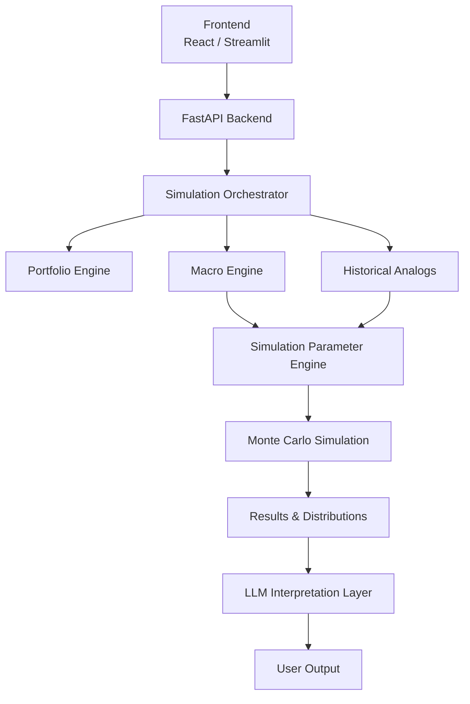

# ARCHITECTURE.md

# DividendLab System Architecture

## Overview

DividendLab is structured as a modular probabilistic financial modeling framework.

The system is intentionally divided into separate layers so that:

* portfolio mechanics remain independent from simulation logic
* macroeconomic modeling remains independent from the UI
* statistical engines remain independent from the LLM layer
* research and assumptions remain transparent and testable

The architecture is designed around:

* modularity
* reproducibility
* statistical transparency
* local-first execution
* separation of concerns

---

# High-Level System Architecture



---

# Full Project File Tree

```text
Dividendlab/
│
├── backend/
│   │
│   ├── main.py
│   │
│   ├── api/
│   │   ├── routes.py
│   │   ├── portfolio_routes.py
│   │   ├── simulation_routes.py
│   │   ├── macro_routes.py
│   │   ├── analog_routes.py
│   │   └── llm_routes.py
│   │
│   ├── portfolio/
│   │   ├── portfolio_manager.py
│   │   ├── dividend_model.py
│   │   ├── dividend_growth.py
│   │   ├── contribution_model.py
│   │   ├── withdrawal_model.py
│   │   ├── rebalancing.py
│   │   ├── valuation.py
│   │   └── portfolio_metrics.py
│   │
│   ├── macro/
│   │   ├── indicator_loader.py
│   │   ├── feature_engineering.py
│   │   ├── regime_classifier.py
│   │   ├── regime_probabilities.py
│   │   ├── regime_transition_model.py
│   │   ├── macro_factor_model.py
│   │   └── economic_state.py
│   │
│   ├── analogs/
│   │   ├── analog_engine.py
│   │   ├── similarity_metrics.py
│   │   ├── embedding_generator.py
│   │   ├── vector_store.py
│   │   ├── historical_snapshots.py
│   │   └── analog_ranker.py
│   │
│   ├── simulation/
│   │   ├── simulation_runner.py
│   │   ├── monte_carlo.py
│   │   ├── return_model.py
│   │   ├── volatility_model.py
│   │   ├── inflation_model.py
│   │   ├── correlation_model.py
│   │   ├── tail_risk_model.py
│   │   ├── jump_diffusion.py
│   │   ├── stochastic_dividend_model.py
│   │   ├── parameter_generator.py
│   │   ├── scenario_engine.py
│   │   └── simulation_statistics.py
│   │
│   ├── optimization/
│   │   ├── efficient_frontier.py
│   │   ├── portfolio_optimizer.py
│   │   ├── risk_parity.py
│   │   └── allocation_constraints.py
│   │
│   ├── llm/
│   │   ├── ollama_client.py
│   │   ├── prompt_templates.py
│   │   ├── simulation_explainer.py
│   │   ├── macro_summary.py
│   │   ├── report_generator.py
│   │   └── research_assistant.py
│   │
│   ├── validation/
│   │   ├── backtesting.py
│   │   ├── stress_testing.py
│   │   ├── sensitivity_analysis.py
│   │   ├── overfitting_checks.py
│   │   ├── walk_forward_testing.py
│   │   └── statistical_validation.py
│   │
│   ├── data/
│   │   ├── database.py
│   │   ├── market_data.py
│   │   ├── macro_data.py
│   │   ├── fred_client.py
│   │   ├── sec_data.py
│   │   ├── schemas.py
│   │   ├── loaders.py
│   │   └── cache_manager.py
│   │
│   ├── utils/
│   │   ├── math_utils.py
│   │   ├── statistics_utils.py
│   │   ├── time_series_utils.py
│   │   ├── validation.py
│   │   ├── logging_utils.py
│   │   └── config_loader.py
│   │
│   └── config.py
│
├── frontend/
│   │
│   ├── react-app/
│   │   ├── components/
│   │   ├── pages/
│   │   ├── charts/
│   │   ├── services/
│   │   ├── hooks/
│   │   └── state/
│   │
│   └── streamlit/
│       ├── dashboard.py
│       ├── portfolio_ui.py
│       ├── macro_ui.py
│       └── simulation_ui.py
│
├── database/
│   ├── schema.sql
│   ├── seed_data.sql
│   └── migrations/
│
├── research/
│   │
│   ├── assumptions/
│   │   ├── macro_assumptions.md
│   │   ├── market_assumptions.md
│   │   ├── dividend_assumptions.md
│   │   └── simulation_assumptions.md
│   │
│   ├── methodology/
│   │   ├── monte_carlo.md
│   │   ├── regime_models.md
│   │   ├── volatility_models.md
│   │   ├── analog_retrieval.md
│   │   └── portfolio_theory.md
│   │
│   ├── validation/
│   │   ├── model_validation.md
│   │   ├── overfitting_prevention.md
│   │   ├── non_stationarity.md
│   │   └── stress_testing.md
│   │
│   ├── references/
│   │   ├── papers.md
│   │   ├── books.md
│   │   └── datasets.md
│   │
│   └── future_research/
│       ├── regime_switching.md
│       ├── dynamic_covariance.md
│       └── macro_factor_expansion.md
│
├── notebooks/
│   ├── monte_carlo_testing.ipynb
│   ├── macro_analysis.ipynb
│   ├── volatility_experiments.ipynb
│   ├── regime_detection.ipynb
│   └── analog_similarity.ipynb
│
├── tests/
│   ├── test_portfolio.py
│   ├── test_simulation.py
│   ├── test_macro.py
│   ├── test_analogs.py
│   ├── test_validation.py
│   └── test_llm.py
│
├── requirements.txt
├── README.md
├── RESEARCH.md
├── ARCHITECTURE.md
└── .gitignore
```

---

# Backend Layer Responsibilities

## API Layer

Responsible for:

* handling frontend requests
* validating inputs
* launching simulations
* returning processed outputs
* interfacing with the LLM layer

Key files:

```text
api/
├── portfolio_routes.py
├── simulation_routes.py
├── macro_routes.py
├── analog_routes.py
└── llm_routes.py
```

---

## Portfolio Engine

Responsible for deterministic portfolio mechanics.

Handles:

* dividends
* reinvestment
* contributions
* withdrawals
* rebalancing
* portfolio valuation

Key files:

```text
portfolio/
├── dividend_model.py
├── dividend_growth.py
├── contribution_model.py
├── withdrawal_model.py
├── valuation.py
└── rebalancing.py
```

This layer should remain independent from stochastic simulation logic whenever possible.

---

## Macro Engine

Responsible for:

* macroeconomic feature generation
* economic state classification
* regime probabilities
* transition modeling

Key files:

```text
macro/
├── indicator_loader.py
├── regime_classifier.py
├── regime_transition_model.py
└── macro_factor_model.py
```

Potential future methodologies:

* Hidden Markov Models
* Bayesian regime switching
* clustering models
* factor models

---

## Historical Analog Engine

Responsible for identifying historically similar market conditions.

Key files:

```text
analogs/
├── analog_engine.py
├── similarity_metrics.py
├── vector_store.py
└── analog_ranker.py
```

The analog engine may use:

* vector embeddings
* macroeconomic feature vectors
* similarity scoring
* ranking systems

This system provides contextual comparison rather than deterministic forecasting.

---

## Simulation Engine

Responsible for probabilistic market simulations.

Key files:

```text
simulation/
├── monte_carlo.py
├── return_model.py
├── volatility_model.py
├── inflation_model.py
├── correlation_model.py
├── jump_diffusion.py
└── stochastic_dividend_model.py
```

This is the primary stochastic modeling layer.

---

## LLM Layer

Responsible for:

* report generation
* simulation explanation
* contextual summaries
* natural language interpretation

Key files:

```text
llm/
├── ollama_client.py
├── simulation_explainer.py
├── report_generator.py
└── macro_summary.py
```

The LLM is not intended to function as the primary predictive engine.

---

# Data Flow

## 1. User Input → API

```text
React / Streamlit UI
        ↓
FastAPI endpoint (/simulation/run)
```

The user submits:

* portfolio information
* macro assumptions
* simulation settings
* time horizons
* contribution schedules
* risk parameters

---

## 2. API → Simulation Runner

```text
simulation_routes.py
        ↓
simulation_runner.py
```

This is the central orchestration layer.

Responsibilities include:

* loading inputs
* initializing models
* preparing simulation parameters
* coordinating simulation execution
* returning results

---

## 3. Simulation Runner → Macro Engine

```text
simulation_runner.py
        ↓
regime_classifier.py
        ↓
regime_transition_model.py
```

The macro engine:

* classifies market conditions
* determines regime probabilities
* adjusts simulation assumptions dynamically

Potential outputs:

* expected volatility regime
* inflation regime
* recession probability
* credit stress environment

---

## 4. Historical Analog Integration

```text
simulation_runner.py
        ↓
analog_engine.py
        ↓
similarity_metrics.py
```

The analog engine:

* compares current conditions to historical snapshots
* ranks similar periods
* retrieves contextual historical regimes

Potential outputs:

* similar inflationary periods
* tightening cycles
* crisis environments
* recovery phases

---

## 5. Simulation Parameter Generation

```text
parameter_generator.py
        ↓
volatility_model.py
        ↓
correlation_model.py
```

Simulation parameters are adjusted using:

* macroeconomic conditions
* regime probabilities
* historical analog context

Possible dynamic adjustments:

* volatility
* correlations
* expected returns
* dividend growth assumptions
* tail-risk probability

---

## 6. Monte Carlo Execution

```text
simulation_runner.py
        ↓
monte_carlo.py
```

The Monte Carlo engine performs:

* repeated portfolio simulations
* stochastic return generation
* regime transitions
* inflation adjustments
* dividend modeling

---

## 7. Portfolio Model Integration

Within each simulation step:

```text
return_model.py
        ↓
dividend_model.py
        ↓
valuation.py
        ↓
rebalancing.py
```

This combines:

* stochastic market behavior
* deterministic portfolio mechanics

---

## 8. Statistical Aggregation

```text
simulation_statistics.py
```

Responsible for generating:

* probability distributions
* drawdown statistics
* percentile outcomes
* expected dividend income
* downside analysis
* success probabilities

---

## 9. LLM Interpretation Layer

```text
simulation_statistics.py
        ↓
simulation_explainer.py
        ↓
report_generator.py
```

The LLM layer may generate:

* natural language summaries
* macroeconomic context
* historical analog explanations
* simulation interpretation
* portfolio risk summaries

---

# Core Simulation Flow (End-to-End)

```text
1. Load portfolio (database.py)
2. Load macroeconomic data (macro_data.py)
3. Generate macro feature set
4. Classify economic regime
5. Retrieve historical analogs
6. Initialize simulation parameters
7. FOR each simulation:
       FOR each time step:
           → generate return (return_model.py)
           → apply volatility regime
           → apply inflation effects
           → update dividends
           → rebalance portfolio
           → update portfolio value
           → record statistics
8. Aggregate simulation outputs
9. Generate probability distributions
10. Generate reports and explanations
11. Return results to frontend
```

---

# Validation & Research Workflow

## Statistical Validation

Validation systems are intended to reduce:

* overfitting
* hidden assumptions
* unrealistic simulations
* look-ahead bias
* survivorship bias

Key files:

```text
validation/
├── backtesting.py
├── stress_testing.py
├── overfitting_checks.py
├── walk_forward_testing.py
└── statistical_validation.py
```

---

## Research Workflow

The project follows a research-first development process.

Typical workflow:

```text
Research → Methodology → Validation → Prototype → Implementation
```

Research documentation should define:

* assumptions
* methodologies
* known limitations
* equations
* validation strategies

before major implementation work begins.

---

# Long-Term Expansion Possibilities

Potential future areas:

* dynamic covariance matrices
* copula-based tail dependency modeling
* Bayesian portfolio updating
* factor investing frameworks
* international macroeconomic modeling
* stress-event libraries
* custom local fine-tuned LLM adapters
* multi-agent simulation systems

These are intentionally separated from the MVP architecture to avoid unnecessary complexity during initial development.

