# V1 Developer Specification

## Purpose

This document serves as the technical implementation specification for Version 1 (V1) of the project.

Unlike the project roadmap (`VERSION_PLANNING.md`) or the implementation tracker (`V1_IMPLEMENTATION_PLAN.md`), this document defines the architecture, responsibilities, dependencies, and implementation details of every component required to complete V1.

Its primary goals are to:

* Define the purpose of every remaining file.
* Establish clear architectural boundaries.
* Prevent unnecessary coupling between components.
* Standardize how business logic is implemented.
* Serve as the primary reference for future development.
* Provide consistent context for AI-assisted code generation.

This document should be updated whenever architectural decisions change.

---

# V1 Scope

Version 1 is designed as a deterministic portfolio management application.

The objective is to build a stable foundation that future versions can expand without requiring major architectural changes.

Version 1 includes the following capabilities:

* Portfolio creation and management
* Holdings tracking
* Transaction management
* Dividend tracking
* Contribution scheduling
* Portfolio performance metrics
* Deterministic portfolio projections
* SQLite database storage
* Streamlit user interface

Version 1 intentionally excludes:

* Monte Carlo simulation
* Probabilistic forecasting
* Regime classification
* Historical analog retrieval
* Machine learning models
* AI-generated portfolio recommendations

These features are reserved for later versions of the project.

---

# Current Project Status

The project foundation has already been established.

## Completed

### Project Architecture

* Overall project structure
* Layered backend architecture
* SQLite database architecture
* SQL schema design
* Database separation strategy

---

### Database Infrastructure

Completed components include:

* `database.py`
* `database_initializer.py`
* Transaction management
* Nested savepoint support
* Connection lifecycle management

---

### Database Design

Completed:

* Portfolio schema
* System schema
* Market schema
* Database initialization process

---

### Research

Completed research includes:

* Portfolio projection methodology
* Inflation assumptions
* Dividend assumptions
* Contribution assumptions
* Version planning
* Overall software architecture

No additional research is required before implementing the remaining V1 components.

---

## Remaining Work

The remaining implementation is divided into four major areas.

### Phase 1

Repository Layer

Implement all remaining repositories responsible for interacting with the SQLite database.

---

### Phase 2

Business Logic Layer

Implement all services responsible for portfolio management and deterministic calculations.

---

### Phase 3

Projection Engine

Implement deterministic future portfolio projections using the completed research assumptions.

---

### Phase 4

Streamlit Interface

Develop the graphical user interface for interacting with the portfolio system.

---

# System Architecture

The application follows a layered architecture.

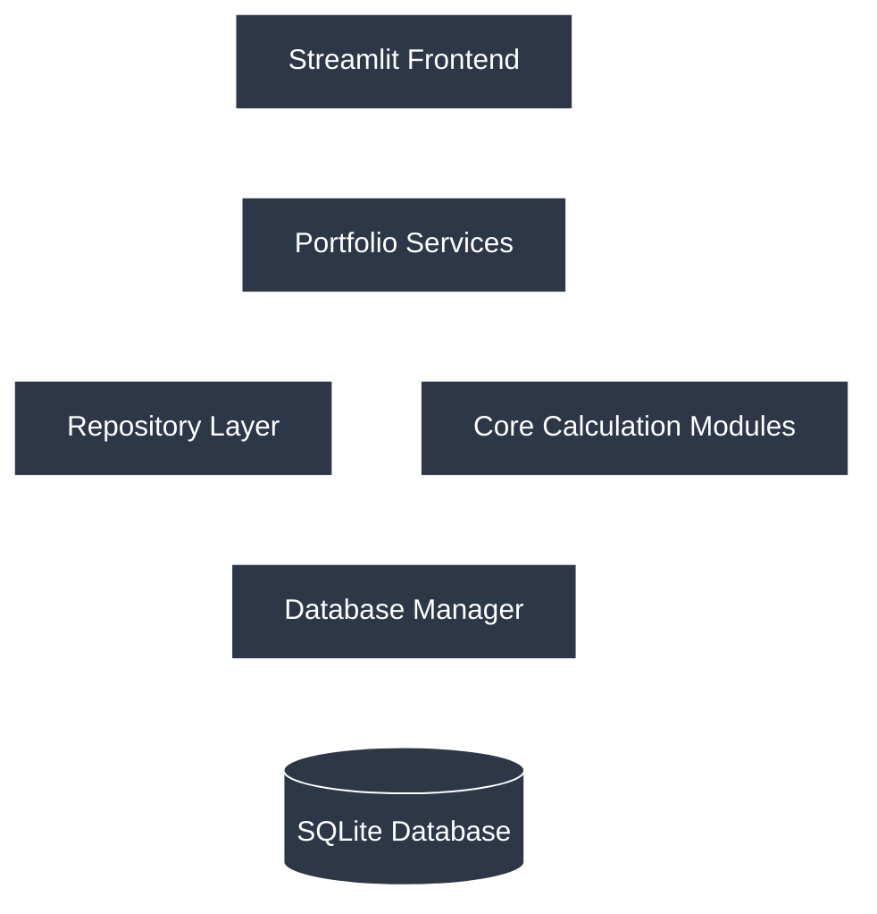
Each layer has a single responsibility.

Higher layers communicate only with the layer directly beneath them.

---

# Architectural Principles

The architecture is intentionally designed around several software engineering principles.

## Single Responsibility Principle

Each file should have one clearly defined purpose.

Examples:

* repositories perform database access
* services coordinate business operations
* core modules perform calculations
* the frontend displays information

Responsibilities should never overlap unnecessarily.

---

## Separation of Concerns

Database infrastructure, business logic, calculations, and user interface are separated into independent layers.

Each layer should be understandable without requiring knowledge of unrelated components.

---

## Repository Pattern

Repositories encapsulate all SQL interactions.

No SQL should appear outside the repository layer.

Repositories should expose meaningful operations rather than SQL statements.

Example:

Instead of executing SQL directly:

```python
cursor.execute(...)
```

Business logic should call:

```python
portfolio_repository.create_portfolio(...)
```

---

## Service Layer Pattern

Services coordinate application workflows.

Services are responsible for:

* validating requests
* coordinating repositories
* calling calculation modules
* returning processed results

Services should never contain SQL.

---

## Pure Calculation Modules

Calculation modules perform deterministic financial calculations.

These modules should:

* contain no SQL
* have no knowledge of the database
* have no Streamlit dependencies
* have no UI logic

Their purpose is to provide reusable financial calculations.

---

## Low Coupling

Components should depend on as few other components as possible.

Reducing dependencies improves maintainability and simplifies future refactoring.

---

## High Cohesion

Each module should contain closely related functionality.

For example:

* dividend calculations belong together
* cost basis calculations belong together
* portfolio metrics belong together

Related functionality should not be spread across multiple files.

---

# Dependency Rules

To maintain architectural consistency, all dependencies must follow the rules below.

## Allowed Dependency Flow

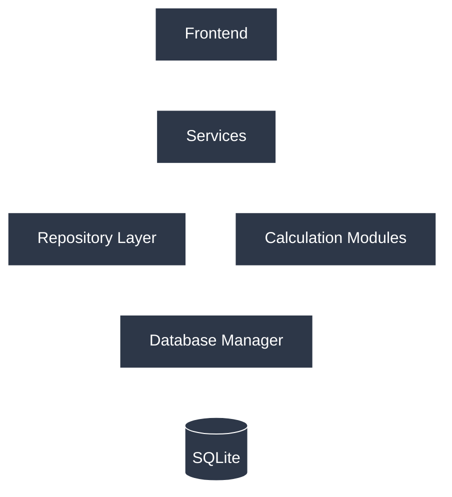
Each layer has a single responsibility.

Higher layers communicate only with the layer directly beneath them.

---
Each layer may communicate only with the layer immediately beneath it.

---

## Forbidden Dependencies

The following interactions are not permitted.

### Frontend

The frontend must never:

* execute SQL
* access repositories directly
* interact with SQLite
* perform financial calculations

The frontend should communicate exclusively through services.

---

### Services

Services must never:

* execute SQL
* access SQLite directly
* implement user interface logic

Services coordinate work but do not own persistence.

---

### Repositories

Repositories must never:

* call other repositories
* contain business rules
* perform financial calculations
* access Streamlit components

Repositories exist solely to manage data access.

---

### Core Modules

Core modules must never:

* execute SQL
* import repositories
* import Streamlit
* depend on database state

They should operate exclusively on the data provided as function inputs.

---

### Database Layer

The database infrastructure must remain independent of every higher layer.

It should have no knowledge of:

* portfolios
* transactions
* dividends
* business logic
* user interface

Its responsibility is limited to providing safe and reliable database access.

---

# Project Structure

The Version 1 backend is organized into four primary layers.

```text
backend/
│
├── api/
│
├── data/
│   │
│   ├── database.py
│   ├── database_initializer.py
│   │
│   ├── schemas/
│   │
│   └── repositories/
│       ├── app_settings_repository.py
│       ├── portfolio_repository.py
│       ├── holdings_repository.py
│       ├── transaction_repository.py
│       ├── dividend_repository.py
│       └── contribution_repository.py
│
├── portfolio/
│   │
│   ├── services/
│   │   ├── portfolio_service.py
│   │   ├── holdings_service.py
│   │   ├── transaction_service.py
│   │   ├── dividend_service.py
│   │   ├── contribution_service.py
│   │   └── projection_service.py
│   │
│   └── core/
│       ├── metrics.py
│       ├── validation.py
│       ├── cost_basis.py
│       ├── allocation.py
│       ├── dividend_calculations.py
│       └── projection_math.py
│
├── utils/
│
└── config.py
```

---

# Layer Responsibilities

## Database Infrastructure

Responsible for:

* database connections
* transactions
* initialization
* schema creation

This layer provides the foundation for all persistence operations.

---

## Repository Layer

Responsible for:

* database queries
* inserts
* updates
* deletes
* record retrieval

Repositories own all SQL.

---

## Service Layer

Responsible for:

* portfolio workflows
* coordinating repositories
* validating operations
* preparing data for presentation

Services contain the application's business logic.

---

## Core Layer

Responsible for:

* deterministic calculations
* portfolio mathematics
* cost basis calculations
* allocation calculations
* projection formulas

These modules are independent of both the database and user interface.

---

## Frontend

Responsible for:

* displaying information
* collecting user input
* presenting charts
* navigation

The frontend contains no business logic and no database access.

---

# Design Goals

The Version 1 architecture is intended to provide a stable foundation for future development.

Specifically, it should:

* remain understandable as the project grows
* isolate database changes from business logic
* isolate business logic from the user interface
* maximize code reuse
* minimize duplicated logic
* simplify testing
* support future probabilistic simulation engines without requiring significant refactoring

Later versions will extend this architecture by adding simulation, macroeconomic modeling, historical analog analysis, and AI-assisted reporting while preserving the core portfolio management system established in Version 1.

# Repository Layer Specification

## Overview

The Repository Layer is responsible for all interactions with the SQLite database.

Repositories provide a clean abstraction over database tables by exposing domain-specific operations instead of raw SQL statements.

The repository layer serves as the interface between the application's business logic and the underlying database infrastructure.

All SQL queries, inserts, updates, and deletes must remain inside this layer.

---

# Repository Architecture

```text
                  Service Layer
                        │
                        ▼
              Repository Interface
                        │
                        ▼
                 database.py
                        │
                        ▼
                    SQLite
```
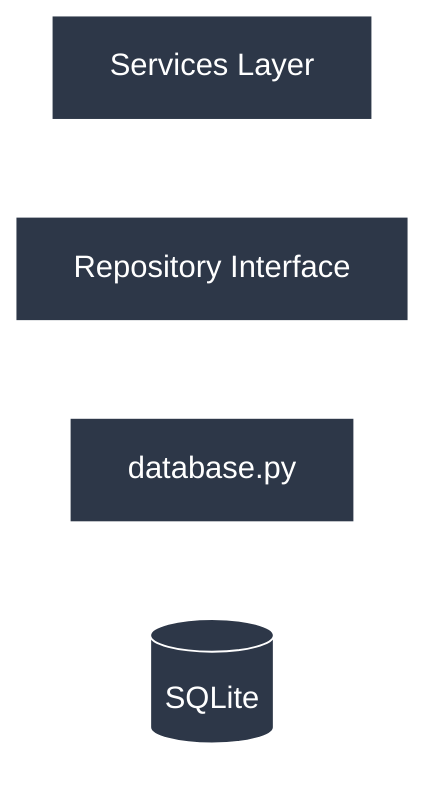
Each layer has a single responsibility.

Higher layers communicate only with the layer directly beneath them.

---
Repositories should never communicate with one another.

If a workflow requires data from multiple repositories, coordination must occur within the Service Layer.

---

# Repository Design Standards

All repositories should follow the same design principles.

## Responsibilities

Each repository is responsible for:

* Creating records
* Reading records
* Updating records
* Deleting records
* Searching records
* Returning domain objects or dictionaries

Repositories should not:

* Perform calculations
* Validate business rules
* Update unrelated tables
* Execute application workflows
* Call other repositories

---

# Common Repository Interface

Although each repository manages different tables, they should follow a consistent naming convention whenever practical.

Typical operations include:

```python
create()

get()

list()

update()

delete()
```

Optional operations may include:

```python
exists()

count()

search()

archive()

restore()
```

Using consistent method names improves readability and makes the repositories easier to learn and maintain.

---

# Repository Dependencies

All repositories depend on:

```text
database.py
```

Repositories do not depend on:

* Streamlit
* Service Layer
* Core Calculation Modules
* Other Repositories

---

# Repository Specifications

---

# AppSettingsRepository

## Purpose

Manages application-wide configuration stored in the database.

This repository is already implemented and serves as the reference implementation for future repositories.

---

## Database Tables

* application_settings

---

## Responsibilities

* Store application preferences
* Retrieve application preferences
* Update configuration values
* Reset configuration values

---

## Public Methods

```python
get_setting()

set_setting()

delete_setting()

setting_exists()

list_settings()
```

---

## Used By

* Application startup
* Settings page
* ProjectionService
* Future configuration systems

---

# PortfolioRepository

## Purpose

Owns all portfolio-related database operations.

Each portfolio represents an independent investment account.

---

## Database Tables

* portfolios

---

## Responsibilities

* Create portfolios
* Retrieve portfolios
* Rename portfolios
* Delete portfolios
* List portfolios

PortfolioRepository is not responsible for holdings or transactions.

---

## Public Methods

```python
create_portfolio()

get_portfolio()

list_portfolios()

update_portfolio()

delete_portfolio()

portfolio_exists()

count_portfolios()
```

---

## Returns

Typical return values include:

* Portfolio dictionary
* Portfolio object (future)
* List of portfolios
* Boolean success indicators

---

## Used By

* PortfolioService
* ProjectionService

---

# HoldingsRepository

## Purpose

Stores the current state of each portfolio's holdings.

The holdings table represents the portfolio's current positions rather than individual trades.

---

## Database Tables

* holdings

---

## Responsibilities

* Add holdings
* Update holdings
* Delete holdings
* Retrieve holdings
* Retrieve individual positions

---

## Public Methods

```python
add_holding()

get_holding()

get_holdings()

update_holding()

delete_holding()

holding_exists()

list_tickers()
```

---

## Notes

Holdings are updated by the TransactionService after transactions are processed.

The repository itself does not calculate holdings.

---

## Used By

* HoldingsService
* TransactionService
* DividendService

---

# TransactionRepository

## Purpose

Stores every portfolio transaction.

Transactions provide the historical record from which holdings can be reconstructed if necessary.

---

## Database Tables

* transactions

---

## Responsibilities

* Record transactions
* Retrieve transaction history
* Edit transactions
* Delete transactions
* Filter transaction history

---

## Public Methods

```python
add_transaction()

get_transaction()

list_transactions()

list_portfolio_transactions()

update_transaction()

delete_transaction()

transaction_exists()
```

---

## Notes

Transactions should remain immutable whenever possible.

Editing historical transactions should be limited to correcting user errors.

Business rules controlling edits belong in the Service Layer.

---

## Used By

* TransactionService

---

# DividendRepository

## Purpose

Stores historical dividend payments received by portfolio holdings.

---

## Database Tables

* dividend_history

---

## Responsibilities

* Record dividends
* Retrieve dividend history
* Update dividend records
* Delete dividend records

---

## Public Methods

```python
record_dividend()

get_dividend()

list_dividends()

list_portfolio_dividends()

update_dividend()

delete_dividend()
```

---

## Used By

* DividendService

---

# ContributionRepository

## Purpose

Stores recurring contribution schedules used by deterministic projections.

---

## Database Tables

* contribution_schedule

---

## Responsibilities

* Create schedules
* Retrieve schedules
* Update schedules
* Delete schedules

---

## Public Methods

```python
create_schedule()

get_schedule()

list_schedules()

update_schedule()

delete_schedule()

schedule_exists()
```

---

## Used By

* ContributionService
* ProjectionService

---

# Future Repositories

The following repositories are planned for later versions and are intentionally excluded from Version 1.

## MarketDataRepository

Future responsibilities:

* Historical prices
* Daily price updates
* Security metadata

Introduced in a future version after deterministic portfolio management is complete.

---

## MacroRepository

Future responsibilities:

* Inflation data
* Interest rates
* Economic indicators

Introduced during macroeconomic modeling.

---

## SimulationRepository

Future responsibilities:

* Store simulation results
* Simulation metadata
* Historical runs

Introduced alongside the Monte Carlo engine.

---

# Repository Interaction Rules

Repositories must never call one another.

Example of an incorrect workflow:

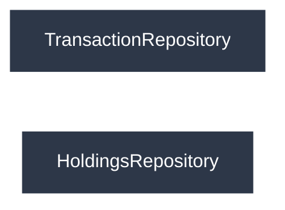

Repositories should remain completely independent.

Instead:

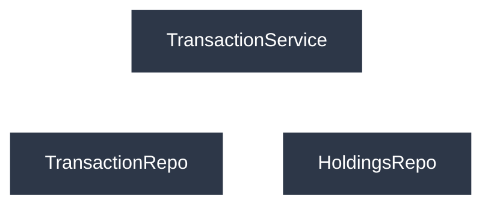

The Service Layer coordinates all interactions between repositories.

---

# Error Handling

Repositories are responsible for reporting database-related errors.

Examples include:

* Missing records
* Constraint violations
* Duplicate primary keys
* Failed updates
* Foreign key violations

Repositories should not decide how the application responds to these errors.

Instead, they should:

* Raise well-defined exceptions, or
* Return structured error results

Application-level decisions belong in the Service Layer.

---

# Transaction Management

Repositories should not manually manage transactions.

Instead, they should rely on the transaction utilities provided by `database.py`.

This ensures:

* Consistent transaction handling
* Proper rollback behavior
* Nested transaction support
* Centralized error recovery

---

# Repository Lifecycle

The expected lifecycle for a typical repository operation is:

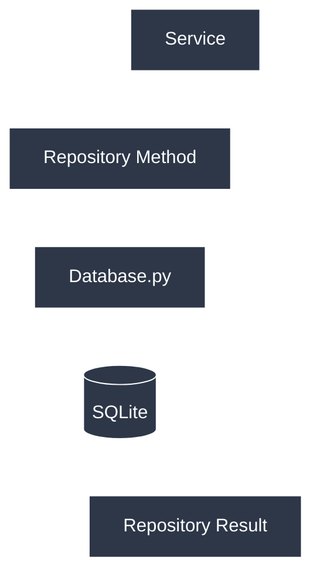

Repositories remain intentionally simple.

They perform data persistence and retrieval while delegating business decisions to higher layers.

---

# Repository Design Goals

The Repository Layer has been designed to achieve the following objectives:

* Centralize all SQL code
* Isolate the database from business logic
* Simplify future database migrations
* Promote code reuse
* Improve maintainability
* Support unit testing through isolated data access
* Provide a stable interface for future application features

This layer forms the foundation of the Version 1 application and will continue to support future versions as probabilistic simulations, macroeconomic models, and AI-assisted analysis are added.


# Service Layer & Core Module Specification

## Overview

The Service Layer contains the application's business logic.

Unlike repositories, which only interact with the database, services coordinate application workflows by:

* Validating user requests
* Retrieving data from repositories
* Calling calculation modules
* Applying business rules
* Returning processed results to the frontend

Services act as the bridge between the user interface and the data layer.

---

# Service Layer Architecture

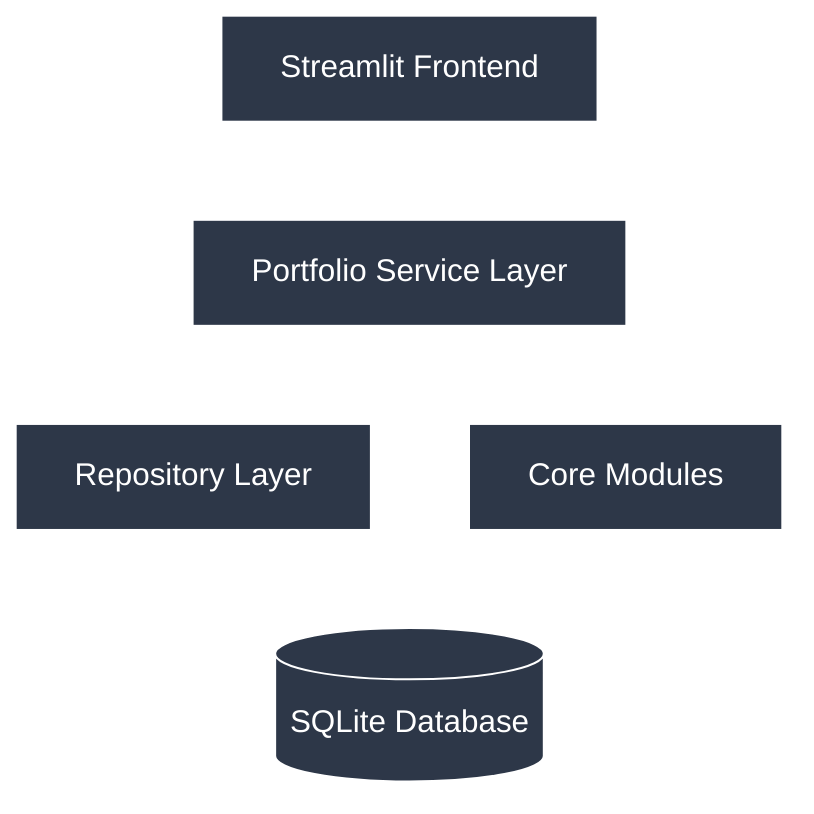

Services are the only layer that communicates with both repositories and core calculation modules.

---

# Service Layer Responsibilities

Each service should:

* Coordinate one business domain.
* Call one or more repositories.
* Call reusable calculation modules.
* Validate user input.
* Return structured results.
* Raise meaningful exceptions when necessary.

Services should **not**:

* Execute SQL.
* Communicate directly with SQLite.
* Render Streamlit components.
* Contain duplicate mathematical formulas.

---

# PortfolioService

## Purpose

PortfolioService coordinates all high-level portfolio operations.

It acts as the primary entry point for portfolio management throughout the application.

---

## Responsibilities

* Create portfolios
* Rename portfolios
* Delete portfolios
* Retrieve portfolio summaries
* Coordinate other services
* Prepare dashboard data

---

## Dependencies

Uses:

```text
PortfolioRepository

Metrics

Validation
```

Called by:

```text
Dashboard

Portfolio Page

ProjectionService
```

---

## Public Methods

```python
create_portfolio()

rename_portfolio()

delete_portfolio()

get_portfolio()

list_portfolios()

get_portfolio_summary()

get_dashboard_data()
```

---

## Notes

PortfolioService should not calculate metrics directly.

Instead, it delegates calculations to the Core Layer.

---

# HoldingsService

## Purpose

Manages the current state of portfolio holdings.

This service provides business logic for viewing and updating holdings.

---

## Responsibilities

* Retrieve holdings
* Refresh holdings after transactions
* Calculate allocations
* Calculate cost basis
* Prepare holdings summaries

---

## Dependencies

Uses:

```text
HoldingsRepository

Metrics

Allocation

CostBasis

Validation
```

Called by:

```text
PortfolioService

TransactionService
```

---

## Public Methods

```python
get_holdings()

get_holding()

refresh_holdings()

calculate_allocations()

calculate_cost_basis()

get_holdings_summary()
```

---

# TransactionService

## Purpose

Processes all portfolio transactions.

This service contains the application's trade processing workflow.

---

## Responsibilities

* Buy shares
* Sell shares
* Edit transactions
* Delete transactions
* Validate trades
* Update holdings

---

## Dependencies

Uses:

```text
TransactionRepository

HoldingsRepository

Validation

CostBasis
```

Called by:

```text
Transaction Page
```

---

## Public Methods

```python
buy()

sell()

edit_transaction()

delete_transaction()

list_transactions()

get_transaction_history()
```

---

## Notes

TransactionService coordinates updates across multiple repositories.

Repositories remain unaware of one another.

---

# DividendService

## Purpose

Manages dividend-related workflows.

---

## Responsibilities

* Record dividend payments
* Calculate dividend income
* Apply DRIP
* Retrieve dividend history

---

## Dependencies

Uses:

```text
DividendRepository

HoldingsRepository

DividendCalculations

Metrics
```

Called by:

```text
Dividend Page
```

---

## Public Methods

```python
record_dividend()

apply_drip()

list_dividends()

calculate_income()

calculate_yield()
```

---

# ContributionService

## Purpose

Manages recurring contribution schedules.

---

## Responsibilities

* Create schedules
* Modify schedules
* Delete schedules
* Retrieve schedules

---

## Dependencies

Uses:

```text
ContributionRepository

Validation
```

Called by:

```text
ProjectionService

Contribution Page (future)
```

---

## Public Methods

```python
create_schedule()

update_schedule()

delete_schedule()

get_schedule()

list_schedules()
```

---

# ProjectionService

## Purpose

Generates deterministic portfolio projections.

ProjectionService is the highest-level business service within Version 1.

---

## Responsibilities

* Future portfolio growth
* Dividend projections
* Inflation adjustments
* Contribution modeling
* Projection reports

---

## Dependencies

Uses:

```text
PortfolioRepository

ContributionRepository

ProjectionMath

Metrics
```

Called by:

```text
Projection Page
```

---

## Public Methods

```python
project_portfolio()

project_growth()

project_dividends()

project_income()

generate_projection_table()

generate_projection_summary()
```

---

## Notes

ProjectionService performs no financial calculations directly.

All formulas belong in ProjectionMath.

---

# Core Calculation Modules

## Overview

Core modules contain reusable deterministic calculations.

These modules should be completely independent from:

* SQLite
* Streamlit
* Services
* Repositories

Every function should operate solely on its inputs and return calculated results.

---

# Metrics Module

## Purpose

Provides common portfolio performance calculations.

---

## Responsibilities

* Market value
* Total value
* Unrealized gain
* Realized gain
* Dividend yield
* Total return
* Portfolio performance statistics

---

## Public Functions

```python
calculate_market_value()

calculate_total_value()

calculate_total_cost()

calculate_unrealized_gain()

calculate_realized_gain()

calculate_total_return()

calculate_dividend_income()

calculate_cash_balance()
```

---

## Used By

```text
PortfolioService

HoldingsService

DividendService

ProjectionService
```

---

# Validation Module

## Purpose

Provides reusable validation logic.

---

## Responsibilities

* Validate prices
* Validate quantities
* Validate dates
* Validate portfolio IDs
* Validate contribution values
* Validate dividend amounts

---

## Public Functions

```python
validate_price()

validate_quantity()

validate_date()

validate_portfolio()

validate_dividend()

validate_contribution()
```

---

## Used By

All services.

---

# CostBasis Module

## Purpose

Calculates investment cost basis.

Although Version 1 currently uses Average Cost, this module provides a central location for future expansion.

---

## Responsibilities

* Average cost calculations
* Current cost basis
* Position cost calculations

---

## Public Functions

```python
calculate_average_cost()

calculate_position_cost()

calculate_total_cost_basis()
```

---

## Future Expansion

Later versions may add:

* FIFO
* LIFO
* Specific Identification

without modifying other application components.

---

# Allocation Module

## Purpose

Calculates portfolio allocation metrics.

---

## Responsibilities

* Position weights
* Cash allocation
* Sector allocation
* Asset allocation

---

## Public Functions

```python
calculate_position_weight()

calculate_asset_allocation()

calculate_sector_allocation()

calculate_cash_percentage()
```

---

## Used By

```text
HoldingsService

PortfolioService
```

---

# DividendCalculations Module

## Purpose

Provides deterministic dividend calculations.

---

## Responsibilities

* Annual income
* Monthly income
* Dividend yield
* Yield on cost
* DRIP calculations
* Projected dividend growth

---

## Public Functions

```python
calculate_annual_income()

calculate_monthly_income()

calculate_yield()

calculate_yield_on_cost()

calculate_drip_shares()

project_dividend_growth()
```

---

## Used By

```text
DividendService

ProjectionService
```

---

# ProjectionMath Module

## Purpose

Contains all deterministic financial formulas used by Version 1.

---

## Responsibilities

* Compound growth
* Inflation adjustment
* Future value calculations
* Contribution growth
* Dividend projections

---

## Public Functions

```python
calculate_future_value()

calculate_compound_growth()

calculate_inflation_adjustment()

calculate_contribution_growth()

calculate_dividend_projection()

calculate_projection_schedule()
```

---

## Used By

```text
ProjectionService
```

---

# Service Interaction Rules

Services may call:

* Repositories
* Core Modules

Services may **not** call:

* Streamlit pages
* SQLite directly
* Other unrelated services unless explicitly required

Whenever possible, workflows should remain self-contained.

---

# Typical Workflow

## Recording a Transaction

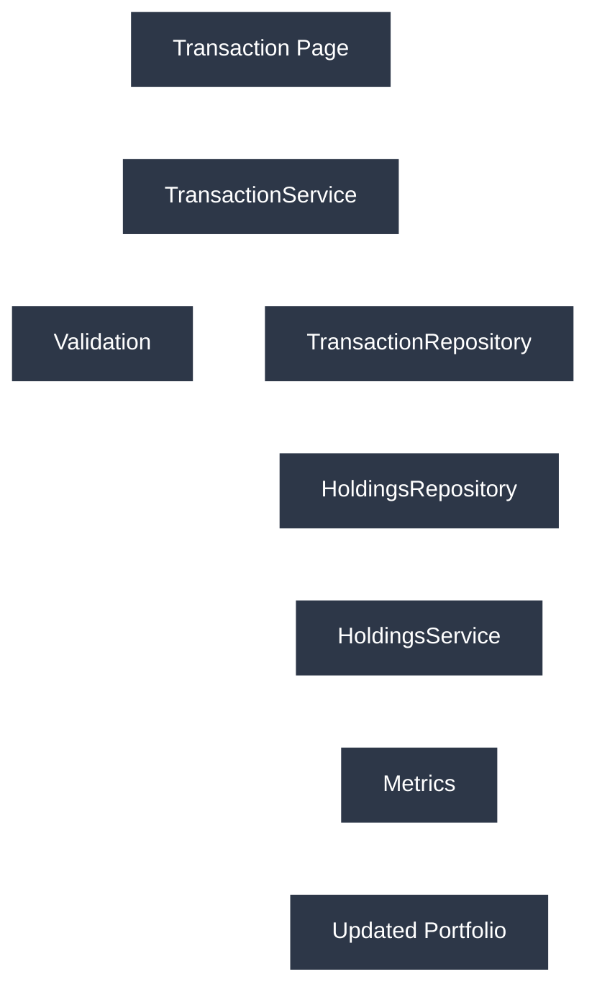

---

## Viewing Portfolio Summary

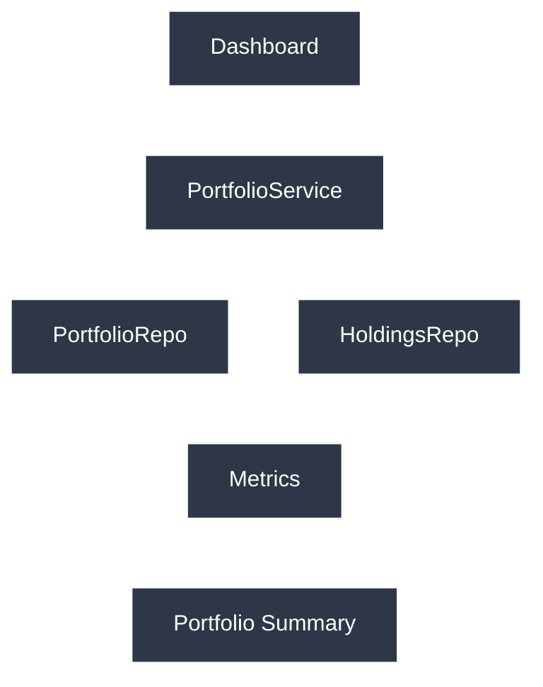

---

## Generating a Projection

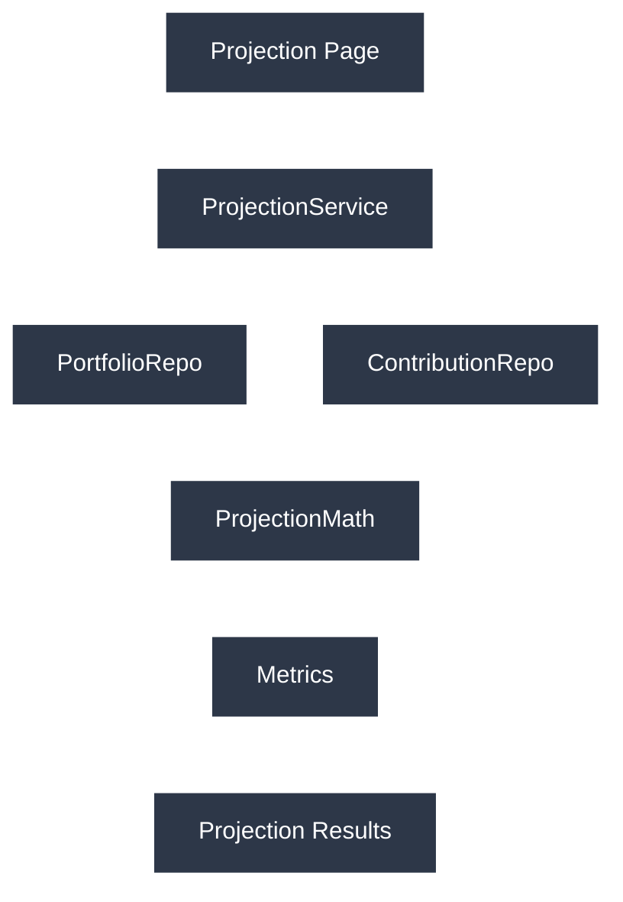

---

# Design Goals

The Service Layer and Core Modules have been separated to achieve the following objectives:

* Keep business workflows independent of database implementation.
* Centralize financial calculations in reusable modules.
* Eliminate duplicated business logic.
* Improve readability and maintainability.
* Support future expansion without modifying existing services.
* Provide a clean foundation for Version 2 statistical simulation and probabilistic modeling.

By separating orchestration (services) from computation (core modules), Version 1 establishes a maintainable architecture that can scale as additional portfolio features and simulation capabilities are introduced.

# Frontend Specification, Development Workflow, and Implementation Plan

## Overview

The frontend provides the user interface for interacting with the portfolio management system.

Unlike the backend, the frontend contains no business logic or database access.

Its responsibilities are limited to:

* Collecting user input
* Displaying portfolio information
* Presenting charts and tables
* Calling the appropriate service methods
* Displaying success and error messages

Every operation performed by the frontend must be executed through the Service Layer.

---

# Frontend Architecture

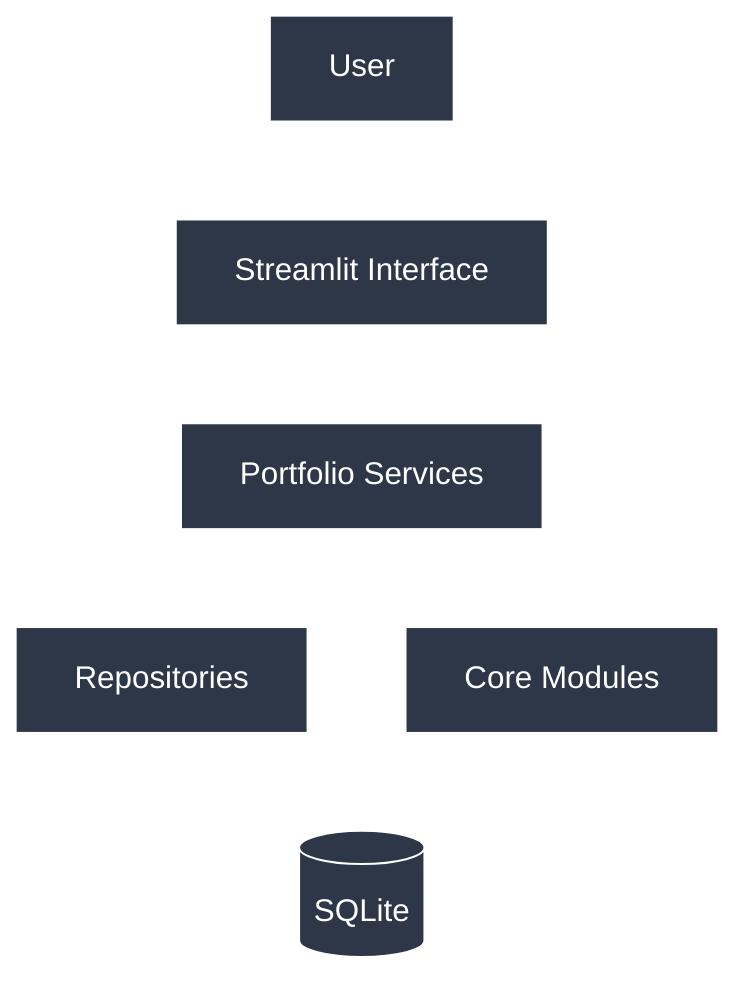

The frontend should never communicate directly with repositories or the database.

---

# Frontend Project Structure

```text
frontend/

└── streamlit/

    ├── app.py
    │
    ├── pages/
    │   ├── dashboard.py
    │   ├── portfolios.py
    │   ├── transactions.py
    │   ├── holdings.py
    │   ├── dividends.py
    │   ├── projections.py
    │   └── settings.py
    │
    ├── components/
    │   ├── portfolio_table.py
    │   ├── holdings_table.py
    │   ├── transaction_table.py
    │   ├── dividend_table.py
    │   ├── projection_chart.py
    │   └── sidebar.py
    │
    └── assets/
```

Splitting reusable widgets into a `components/` directory prevents duplicated Streamlit code and keeps individual pages focused on page-level behavior.

---

# Frontend Pages

## Dashboard

### Purpose

Provides a high-level overview of the user's portfolio.

### Displays

* Portfolio value
* Cash balance
* Annual dividend income
* Allocation summary
* Recent transactions
* Performance metrics

### Uses

```text
PortfolioService
```

---

## Portfolio Page

### Purpose

Manage portfolios.

### Functions

* Create portfolio
* Rename portfolio
* Delete portfolio
* View portfolio information

### Uses

```text
PortfolioService
```

---

## Holdings Page

### Purpose

Display current portfolio holdings.

### Displays

* Ticker
* Shares
* Average Cost
* Current Value
* Allocation
* Unrealized Gain

### Uses

```text
HoldingsService
```

---

## Transactions Page

### Purpose

Record and edit transactions.

### Functions

* Buy shares
* Sell shares
* Edit transactions
* Delete transactions
* View transaction history

### Uses

```text
TransactionService
```

---

## Dividends Page

### Purpose

Manage dividend history.

### Functions

* Record dividend
* View dividend history
* Display dividend income

### Uses

```text
DividendService
```

---

## Projections Page

### Purpose

Generate deterministic future portfolio projections.

### Displays

* Future portfolio value
* Projected dividend income
* Growth tables
* Projection charts

### Uses

```text
ProjectionService
```

---

## Settings Page

### Purpose

Manage application settings.

### Displays

* Currency
* Projection assumptions
* Default contribution values
* Database information

### Uses

```text
AppSettingsRepository
```

---

# User Workflows

## Creating a Portfolio

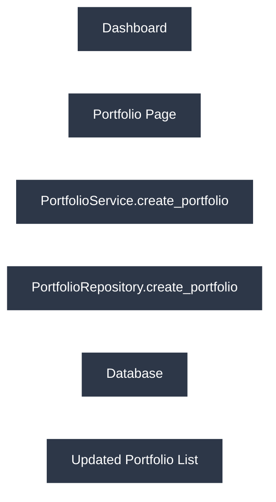

---

## Buying Shares

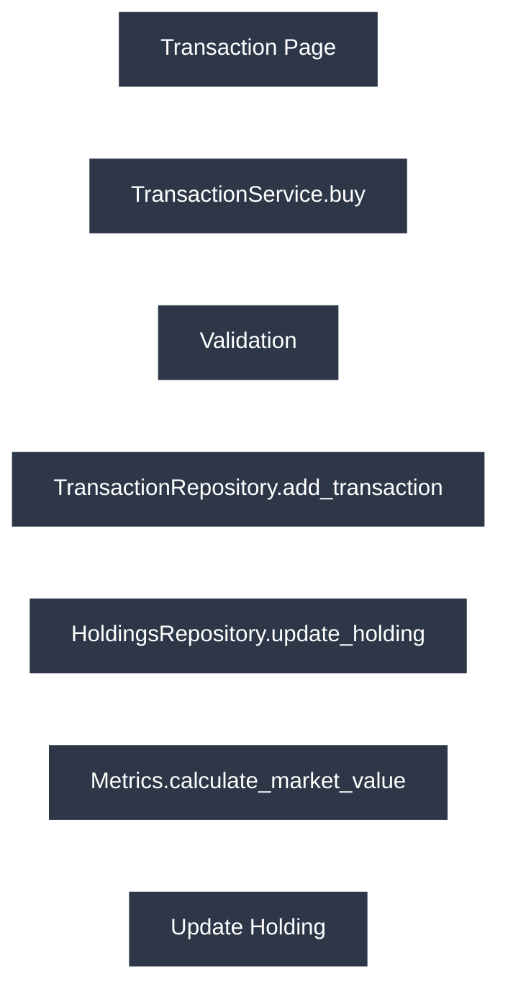

---

## Recording Dividends

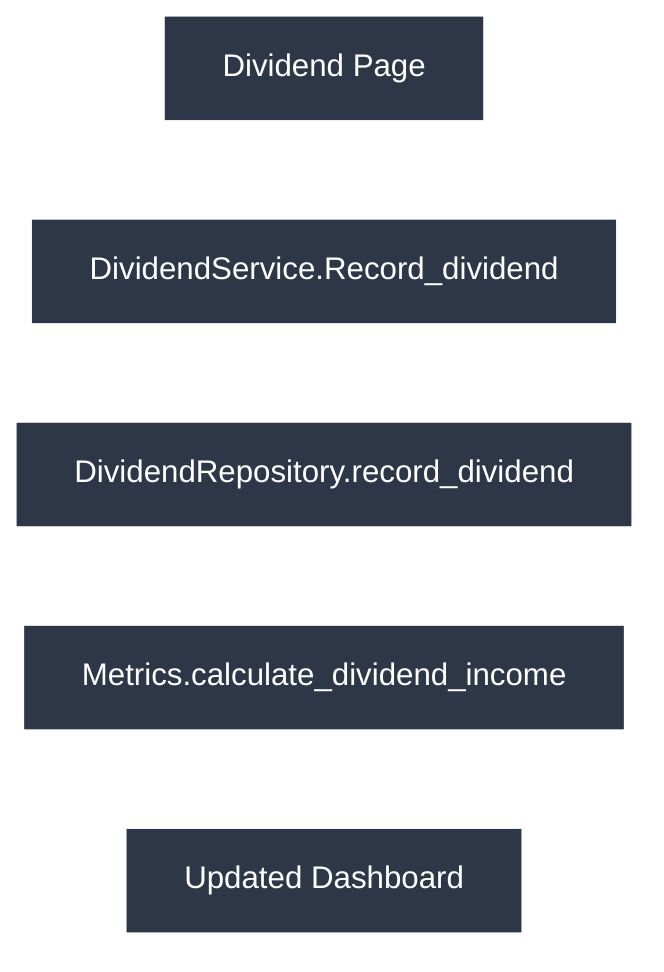

---

## Generating a Projection

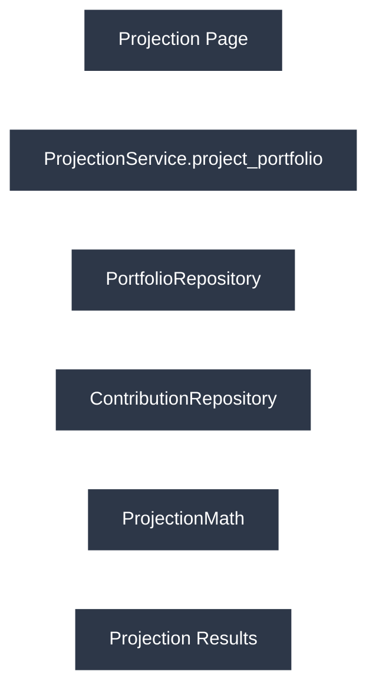

---

# Development Order

To maintain a stable architecture, components should be implemented in dependency order.

## Phase 1 – Database Infrastructure

Completed

* Database manager
* Database initialization
* SQL schema design

---

## Phase 2 – Repository Layer

Remaining

* PortfolioRepository
* HoldingsRepository
* TransactionRepository
* DividendRepository
* ContributionRepository

Repositories provide all database access for the application.

---

## Phase 3 – Core Modules

Remaining

* Validation
* Metrics
* CostBasis
* Allocation
* DividendCalculations
* ProjectionMath

Core modules provide reusable deterministic calculations.

---

## Phase 4 – Service Layer

Remaining

* PortfolioService
* HoldingsService
* TransactionService
* DividendService
* ContributionService
* ProjectionService

Services coordinate workflows between repositories and calculations.

---

## Phase 5 – Frontend

Remaining

* Dashboard
* Portfolio Page
* Holdings Page
* Transactions Page
* Dividends Page
* Projections Page
* Settings Page

The frontend should be implemented only after backend services have been completed.

---

# Testing Strategy

Testing should follow the same dependency order as implementation.

## Database Infrastructure

Verify:

* Database creation
* Transactions
* Rollbacks
* Savepoints
* Schema initialization

---

## Repository Layer

Verify:

* Create
* Read
* Update
* Delete
* Constraint handling
* Error reporting

---

## Core Modules

Verify:

* Financial calculations
* Cost basis calculations
* Allocation calculations
* Projection formulas
* Input validation

---

## Service Layer

Verify:

* Portfolio workflows
* Transaction workflows
* Dividend workflows
* Contribution workflows
* Projection generation

---

## Frontend

Verify:

* Page navigation
* Form validation
* Table rendering
* Chart generation
* User feedback
* Service integration

---

# Version 1 Completion Checklist

## Infrastructure

* [x] Database architecture
* [x] SQL schema
* [x] Database manager
* [x] Database initialization

---

## Repository Layer

* [ ] PortfolioRepository
* [ ] HoldingsRepository
* [ ] TransactionRepository
* [ ] DividendRepository
* [ ] ContributionRepository

---

## Core Modules

* [ ] Validation
* [ ] Metrics
* [ ] CostBasis
* [ ] Allocation
* [ ] DividendCalculations
* [ ] ProjectionMath

---

## Service Layer

* [ ] PortfolioService
* [ ] HoldingsService
* [ ] TransactionService
* [ ] DividendService
* [ ] ContributionService
* [ ] ProjectionService

---

## Frontend

* [ ] Dashboard
* [ ] Portfolio Page
* [ ] Holdings Page
* [ ] Transactions Page
* [ ] Dividends Page
* [ ] Projections Page
* [ ] Settings Page

---

# Future Compatibility

The Version 1 architecture has been designed to support future expansion without requiring major refactoring.

Future versions may introduce:

* Monte Carlo simulation
* Historical analog analysis
* Macroeconomic forecasting
* Machine learning models
* AI-assisted portfolio interpretation
* Multi-user authentication
* REST API endpoints
* Cloud database support

Because Version 1 separates database access, business logic, calculations, and presentation into independent layers, these future capabilities can be integrated while preserving the existing portfolio management system.

---

# Conclusion

Version 1 establishes the foundational architecture for the project.

The repository layer provides reliable data access.

The core modules encapsulate deterministic financial calculations.

The service layer coordinates application workflows.

The frontend presents information to the user without containing business logic.

By following the dependency rules and implementation order defined in this specification, Version 1 can be completed with a maintainable, scalable architecture that provides a stable foundation for all subsequent versions of the project.
