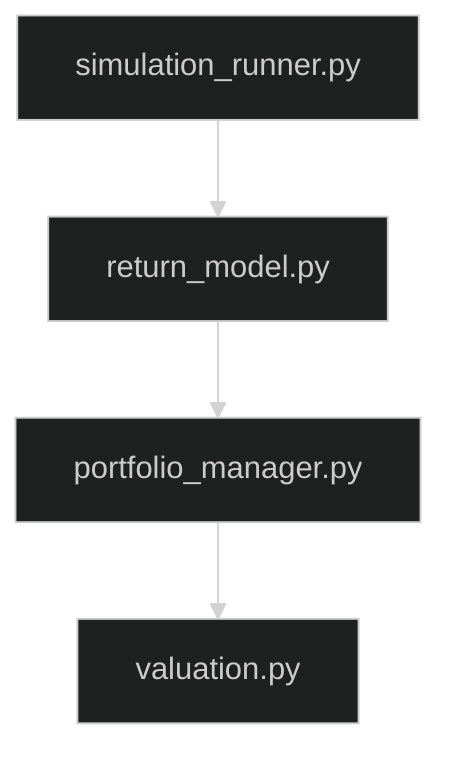

# DividendLab V1 Implementation Plan

## Version Objective

The purpose of Version 1 is **not** to build the final DividendLab architecture. Instead, V1 establishes the deterministic portfolio engine and data infrastructure that every future version will reuse.

At the completion of V1, DividendLab should function as a complete portfolio management and deterministic forecasting application capable of:

* Creating and managing portfolios
* Tracking transactions and holdings
* Downloading and storing market data
* Calculating portfolio metrics
* Tracking dividend income
* Supporting dividend reinvestment (DRIP)
* Managing recurring contributions
* Rebalancing portfolios
* Producing deterministic long-term portfolio projections
* Presenting results through a Streamlit interface

No probabilistic simulation, macroeconomic modeling, historical analog retrieval, or AI reporting should be implemented during V1. The architecture should, however, make it straightforward to integrate these features in future versions.

---

# Development Philosophy

Every component developed during V1 should satisfy four design principles.

## 1. Single Responsibility

Each module should perform one clearly defined task.

Example:

* `portfolio_manager.py` manages portfolios.
* `valuation.py` calculates portfolio values.
* `dividend_model.py` calculates dividend income.

Avoid combining unrelated functionality into a single file.

---

## 2. Loose Coupling

Portfolio mechanics should remain independent of simulation logic.

Future Monte Carlo simulations should be able to reuse the portfolio engine without modification.

---

## 3. Reusable Interfaces

Functions should return clean, structured data instead of directly interacting with the UI.

Future versions should be able to call existing functions without rewriting them.

---

## 4. Incremental Expansion

V2 and beyond should extend existing modules rather than replace them.

Example:

```
V1
simulation_runner.py
    └── deterministic projection

V2
simulation_runner.py
    ├── deterministic projection
    └── Monte Carlo simulation

V3
simulation_runner.py
    ├── deterministic
    ├── Monte Carlo
    └── advanced stochastic models
```

---

# Phase 1 — Database & Data Infrastructure

## Objective

Create a reliable data layer before implementing business logic.

Every future version depends on persistent, validated market and portfolio data.

---

## 1. database/schema.sql

### Purpose

Defines the complete SQLite schema.

Tables should include:

* portfolios
* holdings
* transactions
* dividend_history
* price_history
* contribution_schedule

### Why First

Every module requires persistent storage.

Changing the schema later becomes increasingly difficult.

---

## 2. backend/data/database.py

### Responsibilities

* Initialize SQLite database
* Open and close connections
* CRUD operations
* Transaction management
* Database initialization

### Planned Methods

```
initialize_database()

connect()

disconnect()

execute_query()

insert_record()

update_record()

delete_record()

fetch_one()

fetch_all()
```

### Future Expansion

Future versions can add simulation tables without modifying existing portfolio tables.

---

## 3. backend/data/schemas.py

### Purpose

Define application models for:

* Portfolio
* Holding
* Transaction
* Dividend
* PriceHistory

These models become the shared interface between every backend module.

---

## 4. backend/data/cache_manager.py

### Purpose

Prevent unnecessary API requests.

Responsibilities:

* Cache downloaded data
* Check expiration
* Refresh stale data
* Manage local cache

Future macroeconomic datasets can use this same caching layer.

---

# Phase 2 — Market Data Pipeline

## Objective

Build a reusable data ingestion system.

Future simulations require high-quality historical market data.

---

## market_data.py

### Responsibilities

Retrieve:

* historical prices
* current prices
* dividends
* stock splits

### Planned Methods

```
get_price_history()

get_latest_price()

get_dividend_history()

update_market_data()
```

---

## loaders.py

### Responsibilities

* Validate downloaded data
* Clean missing values
* Normalize formats
* Store data in SQLite

Future macroeconomic loaders should follow this same structure.

---

# Phase 3 — Portfolio Engine

This is the core of V1.

Everything developed later ultimately depends on these modules.

---

## portfolio_manager.py

### Purpose

Central portfolio controller.

This should become the primary interface used by every future simulation.

### Responsibilities

* Create portfolios
* Load portfolios
* Add holdings
* Remove holdings
* Execute trades
* Update prices
* Retrieve portfolio state

### Planned Methods

```
create_portfolio()

load_portfolio()

buy_asset()

sell_asset()

add_holding()

remove_holding()

update_market_values()

get_portfolio()
```

---

## valuation.py

### Purpose

Calculate portfolio value.

### Responsibilities

* Market value
* Cost basis
* Unrealized gains
* Realized gains
* Allocation percentages

### Planned Methods

```
calculate_market_value()

calculate_cost_basis()

calculate_unrealized_gain()

calculate_realized_gain()

calculate_allocations()
```

Future simulations should never duplicate valuation logic.

---

## dividend_model.py

### Purpose

Calculate current dividend income.

### Responsibilities

* Annual income
* Monthly income
* Dividend yield
* Yield on cost

### Planned Methods

```
calculate_annual_income()

calculate_monthly_income()

calculate_forward_yield()

calculate_yield_on_cost()
```

---

## dividend_growth.py

### Purpose

Implement deterministic dividend growth assumptions.

### Responsibilities

* Future dividend projections
* Annual growth
* Dividend schedules

### Planned Methods

```
project_dividend_growth()

future_dividend()

generate_dividend_schedule()
```

Future stochastic dividend models should extend this implementation.

---

## contribution_model.py

### Purpose

Handle recurring contributions.

### Responsibilities

* Monthly contributions
* Annual contributions
* Contribution schedules
* Cash additions

### Suggested Methods

```
apply_contribution()

monthly_schedule()

annual_schedule()
```

---

## rebalancing.py

### Purpose

Calculate portfolio rebalancing.

### Responsibilities

* Target allocations
* Required trades
* Allocation drift
* Rebalancing recommendations

### Planned Methods

```
calculate_target_weights()

allocation_drift()

required_trades()

rebalance()
```

---

# portfolio_metrics.py

## Purpose

Aggregate portfolio statistics.

### Metrics

* Total value
* Total return
* Dividend income
* Dividend yield
* Asset allocation
* CAGR
* Portfolio growth

This module should remain purely analytical.

---

# Phase 4 — Deterministic Projection Engine

## Objective

Implement deterministic long-term forecasting using the researched assumptions.

This becomes the baseline model used for comparison in V2.

---

## return_model.py

### Purpose

Generate deterministic investment returns.

### Planned Methods

```
fixed_return()

annual_growth()

compound_growth()
```

Future GBM and Bootstrap models should implement the same interface.

---

## inflation_model.py

### Purpose

Apply inflation adjustments.

### Planned Methods

```
adjust_for_inflation()

calculate_real_return()

purchasing_power()
```

---

## simulation_runner.py

### Purpose

Central orchestration layer.

This file should coordinate every projection without containing business logic itself.

### Responsibilities

1. Load portfolio
2. Load assumptions
3. Apply contributions
4. Apply deterministic returns
5. Apply dividend growth
6. Apply inflation adjustment
7. Update portfolio value
8. Store yearly results

### Planned Methods

```
run_projection()

initialize_projection()

simulate_year()

record_results()

generate_projection()
```

### Important Design Rule

This file should orchestrate existing modules rather than perform calculations directly.

Future versions should only add additional simulation strategies.

---

# Phase 5 — API Layer

Only implement endpoints required for V1.

---

## routes.py

Main router.

---

## portfolio_routes.py

Endpoints

```
GET /portfolio

POST /portfolio

PUT /portfolio

DELETE /portfolio

POST /transaction
```

---

## simulation_routes.py

Endpoints

```
POST /projection

GET /projection
```

---

### Not Implemented

The following routes belong to future versions:

```
macro_routes.py

analog_routes.py

llm_routes.py
```

---

# Phase 6 — Streamlit Frontend

The frontend should expose existing backend functionality rather than duplicate calculations.

---

## dashboard.py

Application entry point.

Responsibilities:

* navigation
* sidebar
* page routing

---

## portfolio_ui.py

Pages

* Holdings
* Transactions
* Allocations
* Dividend summary

---

## simulation_ui.py

Pages

* Projection assumptions
* Projection charts
* Growth tables
* Inflation-adjusted projections

---

### macro_ui.py

Not implemented during V1.

Reserved for V4.

---

# Phase 7 — Testing

Testing should begin after each major module is functional rather than waiting until the end of development.

---

## test_portfolio.py

Verify

* buying assets
* selling assets
* updating holdings
* valuation
* dividends

---

## test_simulation.py

Verify

* deterministic projections
* inflation adjustments
* contribution schedules
* dividend growth

---

# Architecture Decisions to Protect Future Versions

Several design choices have been made during V1 specifically to support later versions.

## Portfolio Engine Independence

The portfolio engine should never know whether returns are deterministic, Monte Carlo, or regime-based. It simply receives updated prices and dividends.

---

## Simulation Abstraction

The simulation runner should call models through clearly defined interfaces rather than embedding formulas.

Example:



When Monte Carlo is added in V2, only the return generation changes.

---

## Data Layer Reuse

Every future version should retrieve historical data through the existing data pipeline.

Avoid downloading data directly from simulation modules.

---

## Shared Models

Use common data models (`schemas.py`) across the entire application.

Do not create duplicate representations of holdings or transactions.

---

## UI Separation

The Streamlit interface should only display information returned by backend modules.

Business logic should remain entirely within the backend.

---

# Deferred Until Later Versions

The following modules are intentionally excluded from V1:

## V2

* monte_carlo.py
* parameter_generator.py
* simulation_statistics.py

## V3

* volatility_model.py
* correlation_model.py
* jump_diffusion.py
* stochastic_dividend_model.py
* scenario_engine.py
* tail_risk_model.py

## V4

Entire `macro/` package

## V5

Entire `analogs/` package

## V6

Entire `llm/` package

## Future

* optimization/
* validation/
* advanced notebooks

These files should remain compatible with the V1 architecture but should not contain production logic until their respective development phases.

---

# Final Deliverable

By the completion of V1, DividendLab should be a fully functional portfolio management application with deterministic forecasting, serving as the stable foundation upon which probabilistic simulations (V2), advanced financial models (V3), macroeconomic modeling (V4), historical analog analysis (V5), and AI-assisted reporting (V6) can be added without requiring significant refactoring of the existing codebase.